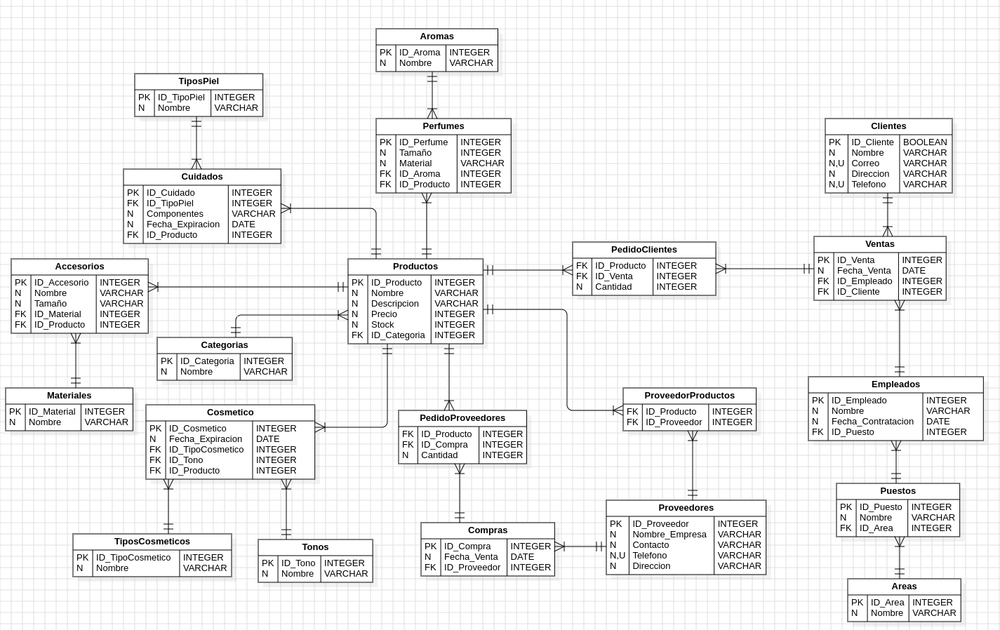

# Maquillaje

## Caso
Eres el encargado de diseñar y modelar la base de datos para una tienda de maquillaje que vende productos como cosméticos, cuidado de la piel, perfumes, y accesorios. La base de datos debe permitir almacenar información sobre productos, clientes, ventas, empleados y proveedores.


## 📊 Entidades Principales

  - **Clientes**: Esta entidad gestiona la información de los usuarios registrados en el sistema, incluyendo su nombre, dirección y datos de contacto. 

  - **Empleados**: Esta entidad gestiona la información de los empleados registrados en el sistema, incluyendo su nombre, el puesto y su fecha de contratacion. 


  - **Productos**: Esta entidad almacena detalles sobre los productos ofrecidos, incluyendo descripciones, precios y características. 


  - **Ventas**: Maneja la información sobre las pedidos de compra realizadas por los usuarios. Incluye detalles como la fecha de la venta, el empleado y el usuario que realizó la compra.


- **Proveedores**: Esta entidad gestiona la información sobre los proveedores que suministran productos. Incluye detalles como el nombre de la empresa, el número de contacto y otros datos relevantes.


## 🌐 Relaciones entre las entidades


1. **Ventas** a **Empleados**: **Uno a Muchos**  
   Un empleado puede ser realizado por varias ventas pero Una venta depende de un empleado.

2. **Ventas** a **Clientes**: **Uno a Muchos**  
   Un cliente puede ser realizado por varias ventas pero Una venta depende de un cliente.

3.  **Proveedores** a **Productos**: **Muchos a Muchos**  
Un proveedor puede ofrecer múltiples productos.Un producto puede ser suministrado por múltiples proveedores.Se representa con la tabla intermedia de ProveedorProducto


4. **Ventas** a **Productos**: **Muchos a Muchos**  
   Una venta puede incluir múltiples productos.Un producto puede ser parte de múltiples ventas. La relacion se representa en la tabla intermedia de PedidosClientes

5. **Proveedores** a **Compras**: **Uno a Muchos**  
    Un proveedor puede dar o suminstrar muchas compras, pero cada compra está vinculado a un único proveedor.

6. **Compras** a **Productos**: **Muchos a Mucos**  
   Una compra puede incluir múltiples productos.Un producto puede ser parte de múltiples compras. La relacion se representa en la tabla intermedia de PedidosProveedores

Estas relaciones estructuran la base de datos y facilitan la gestión de información, asegurando un flujo coherente y organizado de datos.


## 🗺️ Diagrama UML



## Procedimientos almacenados y consultas

``` 
-- Listar todos los productos de cosméticos de un tipo específico (por ejemplo, "labial").

DELIMITER //
CREATE PROCEDURE listarProductosCosmeticos(IN tipoCosmetico VARCHAR(100))
BEGIN
	SELECT cosmeticos.ID_producto,productos.nombre, tiposCosmeticos.nombre AS tipoProducto 
    FROM cosmeticos
    JOIN productos ON cosmeticos.ID_producto = productos.ID_producto
    JOIN tiposCosmeticos ON cosmeticos.ID_tipoCosmetico = tiposCosmeticos.ID_tipoCosmetico
    WHERE tipoCosmetico = tiposCosmeticos.nombre;
END //
DELIMITER ;
CALL listarProductosCosmeticos('Labial')

-- Obtener todos los productos en una categoría (cosméticos, cuidado de la piel, perfumes, accesorios) cuyo stock sea inferior a un valor dado.

DELIMITER //
CREATE PROCEDURE ProductosCategorias(IN Categoria VARCHAR(100), IN Stock INT)
BEGIN
	
	SELECT p.nombre AS productos
    FROM productos p
    JOIN categorias c ON p.ID_categoria = c.ID_categoria
    WHERE p.stock < Stock AND c.nombre = Categoria;
END //
DELIMITER ;

CALL ProductosCategorias ('Perfumes', 20);

-- Mostrar todas las ventas realizadas por un cliente específico en un rango de fechas.

DELIMITER //
CREATE PROCEDURE VentasClientes(IN ID INT, IN Fecha1 DATE,IN Fecha2 DATE )
BEGIN
	
	SELECT v.ID_venta, c.nombre AS Cliente, v.fecha_venta, SUM(pc.Cantidad *p.precio)  AS Total
    FROM clientes c
    JOIN ventas v ON v.ID_cliente = c.ID_cliente
    JOIN pedidosClientes pc ON pc.ID_venta = v.ID_venta
    JOIN  productos p ON p.ID_producto = pc.ID_producto
    WHERE fecha_venta BETWEEN Fecha1 AND Fecha2 AND c.ID_cliente = ID
    GROUP BY v.ID_venta, v.ID_cliente ;
END //
DELIMITER v.ID_venta;

CALL VentasClientes(1, '2023-11-15', '2024-11-30');

-- Calcular el total de ventas realizadas por un empleado en un mes dado.
DELIMITER //
CREATE PROCEDURE totalVetasEmpleado(IN id_empleado VARCHAR(100))
BEGIN
	SELECT empleados.ID_empleado, empleados.nombre, COUNT(ventas.ID_cliente) AS totalVentas
    FROM ventas
    JOIN empleados ON ventas.ID_cliente = empleados.ID_empleado
    WHERE id_empleado = empleados.ID_empleado
    GROUP BY ventas.ID_cliente;
END//

CALL totalVetasEmpleado(1)

-- Listar los productos más vendidos en un período determinado.
DELIMITER //

CREATE PROCEDURE ProductosMasVendidos(IN fechaInicio DATE, IN fechaFin DATE)
BEGIN
    SELECT p.nombre AS producto, SUM(pc.Cantidad) AS total_vendido
    FROM pedidosClientes pc
    INNER JOIN ventas v ON pc.ID_venta = v.ID_venta
    INNER JOIN productos p ON pc.ID_producto = p.ID_producto
    WHERE v.fecha_venta BETWEEN fechaInicio AND fechaFin
    GROUP BY p.nombre
    ORDER BY total_vendido DESC;
END //

DELIMITER ;

CALL ProductosMasVendidos('2024-01-20', '2024-03-01');

-- Consultar el stock disponible de un producto por su nombre o identificador.


DELIMITER //

CREATE PROCEDURE ConsultarStockProducto(IN productoID INT, IN productoNombre VARCHAR(100))
BEGIN
    SELECT p.ID_producto, p.nombre, p.stock
    FROM productos p
    WHERE (p.ID_producto = productoID OR p.nombre = productoNombre)
    LIMIT 1;
END //
DELIMITER ;

CALL ConsultarStockProducto(NULL, 'Lápiz Labial');

-- Mostrar las órdenes de compra realizadas a un proveedor específico en el último año.
DELIMITER //

CREATE PROCEDURE OrdenesDeCompraProveedor(IN IDproveedor INT
)
BEGIN
    SELECT c.ID_compra, c.fecha_compra, p.nombre AS nombre_producto, pp.Cantidad
    FROM compras c
    INNER JOIN pedidosProveedores pp ON c.ID_compra = pp.ID_compra
    INNER JOIN productos p ON pp.ID_producto = p.ID_producto
    WHERE c.ID_proveedor = IDproveedor
        AND c.fecha_compra >= DATE_SUB(CURDATE(), INTERVAL 1 YEAR)
    ORDER BY c.fecha_compra DESC;
END //

DELIMITER ;

CALL OrdenesDeCompraProveedor(2);

-- Listar los empleados que han trabajado más de un año en la tienda.

DELIMITER //
CREATE PROCEDURE EmpleadosAños()
BEGIN
	
    SELECT e.nombre AS Empleado
    FROM empleados e
    WHERE TIMESTAMPDIFF(MONTH, e.fecha_contratacion, CURDATE()) / 12 > 1;
END //
DELIMITER ;

CALL EmpleadosAños()

-- Obtener la cantidad total de productos vendidos en un día específico.
	DELIMITER //

	CREATE PROCEDURE ObtenerCantidadVendidaPorDia(IN fechaEspecifica DATE)
	BEGIN
		SELECT SUM(pc.Cantidad) AS TotalProductosVendidos
		FROM pedidosClientes pc
		JOIN ventas v ON pc.ID_venta = v.ID_venta
		WHERE v.fecha_venta = fechaEspecifica;
	END //

	DELIMITER ;
CALL ObtenerCantidadVendidaPorDia('2024-02-10');

-- Consultar las ventas de un producto específico (por nombre o ID) y cuántas unidades se vendieron.

DELIMITER //

CREATE PROCEDURE ConsultarVentasProducto(IN productoID INT, IN productoNombre VARCHAR(100))
BEGIN
    SELECT p.ID_producto, p.nombre AS producto,SUM(pc.Cantidad) AS total_vendido
    FROM productos p
    INNER JOIN pedidosClientes pc ON p.ID_producto = pc.ID_producto
    INNER JOIN ventas v ON pc.ID_venta = v.ID_venta
    WHERE (p.ID_producto = productoID OR p.nombre = productoNombre)
    GROUP BY p.ID_producto, p.nombre;
END //

DELIMITER ;

CALL ConsultarVentasProducto(NULL, 'Lápiz Labial');
CALL ConsultarVentasProducto(1, NULL);

``` 

## Contribuidores

- Jaime Prada
- Camila Toledo